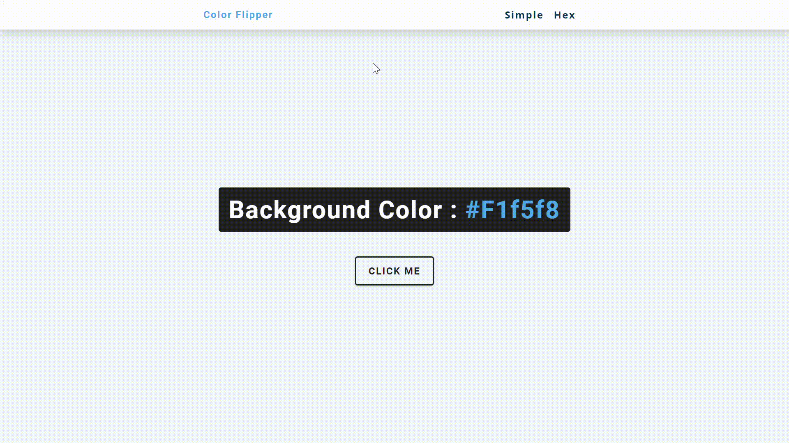

# Color Flipper
 Creating a color flipper with JavaScript. Based on John Smilga's freeCodeCamp project
 
 The project consists on two pages: 
 <ul>
  <li>Simple</li>
  <li>Hex</li>
 </ul>
 
 The <strong>simple</strong> page changes into some previously chosen color values, while <strong>Hex</strong> generates random hex values which will appear on the background. 💻 
 
 ## ✏ Demo
 
 
